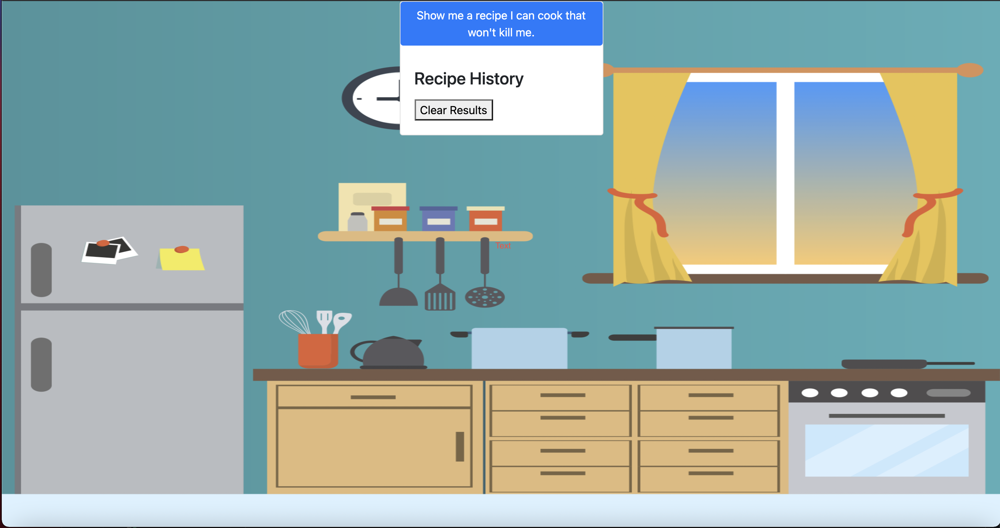
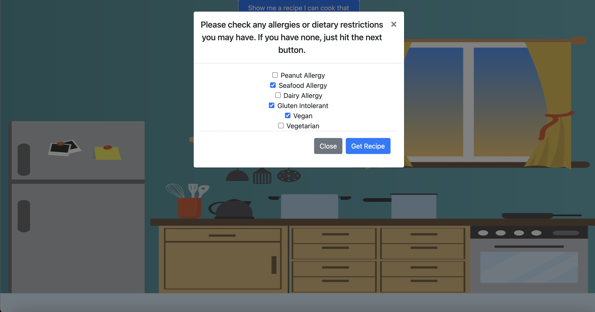
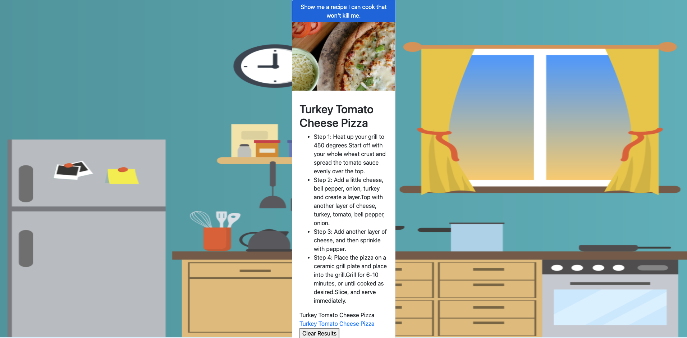

# Coding Bootcamp Project 1

# The Assignment

With your team, you will conceive and execute a design that solves a real-world problem by integrating data received from multiple server-side API requests. Because you will be working collaboratively, you will learn agile development methodologies and implement feature and bug fixes using the git branch workflow and pull requests.

# Project Name: What Can I Eat Without Dying?

# Overview

As we tried to think about a real life problem in class. We realized we were having a hard time as we were all hungry...Well that is a problem by itself. However the problem escalates as we realized a common occurrence is the struggle to decide what to eat every night. So we thought we could make something that picks out a couple meals for us to pick from. Great another 1st world problem solved! But we quickly realized not everyone can eat the same things. So that is when we came up with the idea to create something that can take in any diet restrictions that they may have and produce recipes that a person can actually eat without worrying about dying!

# Instructions

- click here to open the project [Link to our application](https://relentlessreed.github.io/project1/)
- You you open the project the first thing that will great you is a prompt to begin. To start click the "Show me a recipe I can cook that won't kill me."
  
- Next you will see a modal that will ask you to choose any allergies or diets you have.
  
- But what if I do not have any?...Easy you just click on the get the recipes button.
- The next thing that should appear is a recipe for dinner!
  - You should see an image of a prepared meal.
  - The name of the meal
  - Instructions on how to cook it
  - And finally a link for even more details
    
- You will notice that the meals given to you follow your restriction requests.

# Contributors

@relentlessreed
@Jose8160
@GrantShell
